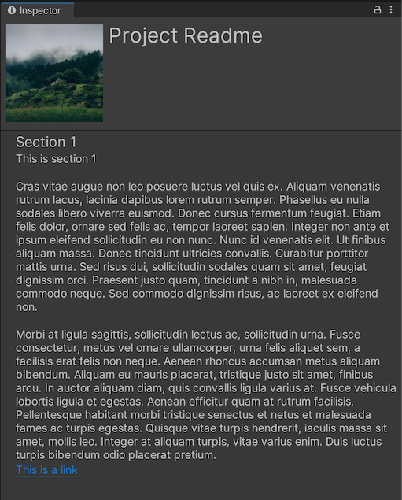
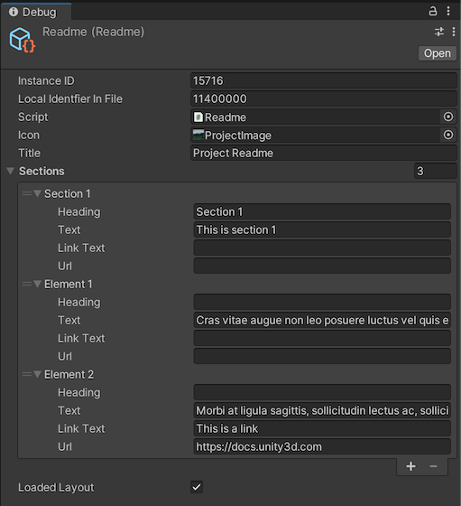

# UnityReadme

Hello! I suspect you ended up here because you are looking for a solution to adding a Readme file to your Unity project or tutorial. Well, you are in luck! This repo presents a simple solution to that problem. 

## Getting started

- [Download the latest release](https://github.com/rjduran/UnityReadme/releases) and install via **Assets > Import Package > Custom Package**.
- Choose all assets in the package and install. 
- This will add a **ProjectInfo** folder and a **Readme.asset** file to your Assets folder. The Readme.asset can be viewed in the Inspector. 
- To view the readme, you can find it under Help > Show Project Readme. 

## How to use

- Edit the Readme.asset file using the Inspector debug view. Look for the 3 small vertical dots in the top right corner of the Inspector panel. Click and choose Debug. 
- Enter information into provided fields and sections.
  - Icon
  - Title
  - Section
    - Heading
    - Text
    - Link Text
    - Url

Note: The Readme.asset file can be modified using either the debug mode in the Unity inspector or by editing YAML in a text editor (ie. Visual Studio Code).

Swap out the ProjectImage.jpg file with your own 300x300 px image as desired. This can be a png or jpg. Generate a placeholder image using [picsum.photos](https://picsum.photos/). [Example: https://picsum.photos/300/300](https://picsum.photos/300/300)

## References

- [Unity YAML](https://docs.unity3d.com/Manual/UnityYAML.html)